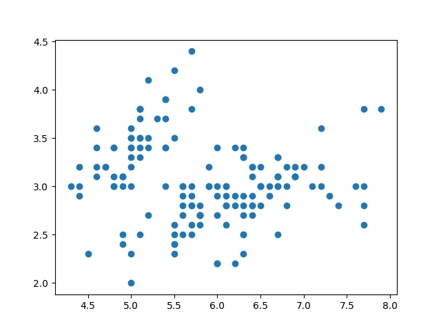
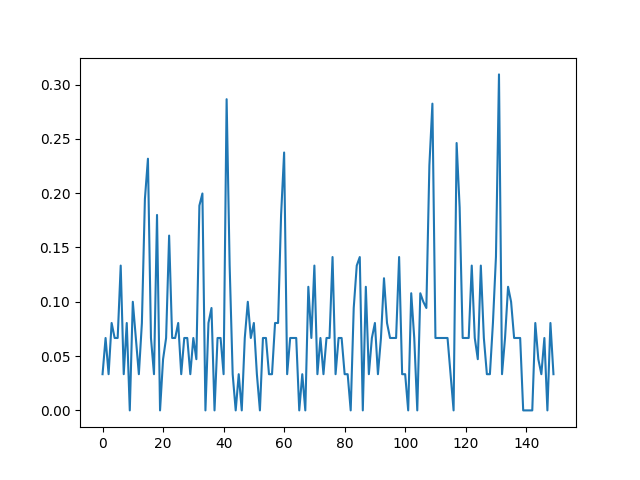
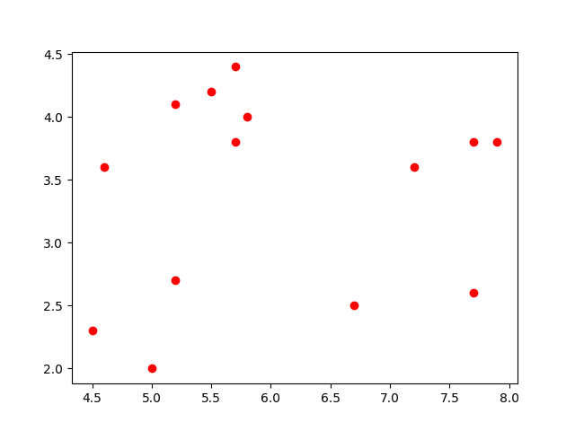

# anomaly-detection-knn
Anomaly detection with kNN(on iris dataset)

## Figure 1
scatter plot of inputs data(sepal length and sepal width)

## Figure 2
mean of k-distances of each observation

## Figure 3 & 4
detected anomalies(blue:no anomaly,red:anomaly):

